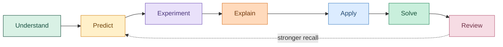

<div align="center">


# ✨ CODYSSEY

### Learn the pattern. Trace the state. Design the system.

**An interactive interview-preparation studio for DSA, HLD and LLD.**

<br />

### [🚀 Open the Codyssey Learning Portal](https://eeshakavuri.github.io/codyssey/)

<br />


</div>

---

## 🚀 Stop memorising. Start understanding.

Codyssey is an **engineering workbench**, not a wall of notes. Follow one idea through **Understand → Predict → Experiment → Explain → Apply**, with a working diagram in the foreground and your notes and references beside it.

Instead of memorising isolated solutions, you learn:

- 🔍 **How to recognise a pattern**
- 🧠 **Which invariant makes the solution work**
- 🎮 **How state changes one step at a time**
- 🧩 **How to adapt a blueprint to unfamiliar problems**
- ⚖️ **How to explain design trade-offs like an engineer**

> [!IMPORTANT]
> Codyssey begins with the bird's-eye view, builds the mental model, traces the implementation, and only then asks you to solve problems.

---

## 🌈 What makes Codyssey different?

<table>
  <tr>
    <td width="50%">
      <h3>🎬 Interactive DSA traces</h3>
      Control execution with play, pause, restart, speed and step navigation. Follow highlighted Python, narration and live variables.
    </td>
    <td width="50%">
      <h3>🧠 Pattern playbooks</h3>
      Learn recognition signals, invariants, reusable implementation templates, complexity and common traps.
    </td>
  </tr>
  <tr>
    <td>
      <h3>🎨 Visual Problem Workspace</h3>
      Build and manipulate data structures while writing your invariant, pseudocode and edge-case tests beside them.
    </td>
    <td>
      <h3>🏗️ HLD + LLD from zero</h3>
      Run 24 topic-specific experiments, from load balancing and replication lag to object invariants and concurrent reservations.
    </td>
  </tr>
  <tr>
    <td>
      <h3>🎯 455 structured questions</h3>
      Practice by pattern and difficulty. Open the original problem while tracking completion separately.
    </td>
    <td>
      <h3>💾 Private, local progress</h3>
      No account required. Resume your lesson stage, DSA inputs and trace position. Export and import your learning progress between devices.
    </td>
  </tr>
</table>

---

## 🧭 The Codyssey learning loop

### A studio that reacts to you

The midnight studio pairs acid-lime, cyan, and lavender learning tracks with expressive typography, pointer-responsive lighting, animated navigation, and tactile interactions. The **Concept Observatory** is playable: follow linked-list pointers, compare cache-hit and cache-miss routes, or swap a payment adapter behind one contract. These previews are illustrative and never award lesson progress.

The same visual language continues through all lessons, the booking case, notes, references, and the spatial workspace. Short-laptop layouts compact the lesson chrome so trace playback stays reachable; mobile gets labeled navigation and locally scrollable diagrams instead of clipped pages.

The header and navigation stay fixed while the document scrolls vertically. Header controls wrap when needed, with their measured height reserved above the content. Lesson tabs adapt to the space left by the menu, not just the browser width. Narrow screens use a fixed bottom dock and a scrollable menu; oversized diagrams and the drawing board scroll within their own regions rather than widening the page.

Use **Motion** in the top bar to enable or disable interface animation without disabling experiments. It follows your system setting until you make an explicit choice; your choice then overrides the system and stays saved on this browser. Preview playback pauses in hidden tabs. The home, visual editor, and DSA experiment renderer are loaded on demand.

Lesson focus mode retains the sidebar's expand/collapse arrow, and remembers your choice. Navigation and lesson tabs do not force the page back to the top. Algorithm canvases and variable slots keep a stable footprint between steps; inactive variables are explicitly labeled, and stack pushes and pops animate when Motion is on. Long explanations, values, and diagrams scroll inside their own labeled regions.

The visual workspace ends its options toolbar with **Enter fullscreen / Exit fullscreen**. Fullscreen preserves the board, notes, and drag coordinates; the old workspace-specific walkthrough has been removed.

Every lesson has two scenario-based reasoning checks. An experiment records **Practised**; experimenting and passing both checks records **Checkpoint cleared**. A playback click alone never completes a lesson. These are learning milestones, not claims of interview mastery.

The home screen resumes your saved lesson and surfaces reasoning gaps for review. Cleared checkpoints return for recall after a day, without streaks or deadlines. Stages remain freely navigable. References live in **Read deeper**, and private **Reasoning notes** stay with each lesson.

### The living system: two people booked the same seat

Replay a double-booking race, switch to an authoritative atomic reservation, and follow the same state through three lenses:

- **HLD:** requests, stale replicas, and the source of truth.
- **LLD:** the `SeatHold` lifecycle and ownership guards.
- **DSA:** a real expiration min-heap, including stale entries that must not release newer or confirmed reservations.

These are educational, deterministic models, not production infrastructure. Design experiments and the booking case reset when you leave or reload them; lesson evidence and notes persist. DSA input, speed, and trace position are saved, and autoplay pauses when you leave Experiment.



---

## 🧪 Visual Problem Workspace

> Draw the state **before** writing the code.

The freeform workspace supports:

| Structure | Visual model |
|---|---|
| 🧱 Arrays | Indexed, editable cells |
| 🟦 Matrices | Row and column coordinates |
| 🔗 Singly linked lists | `VALUE │ NEXT` pointer compartments |
| ↔️ Doubly linked lists | `PREV │ VALUE │ NEXT` reciprocal pointers |
| 📚 Stacks | LIFO cells with a visible `TOP` |
| 🚶 Queues | FIFO cells with `FRONT` and `REAR` |
| 🌳 Binary trees | `LEFT │ VALUE │ RIGHT` child pointers |
| 🔺 Heaps | Array-indexed parent and child relationships |
| 🔤 Tries | Character nodes with multi-child links |
| 🕸️ Graphs | Freeform nodes, edges and degree indicators |

### Workspace superpowers

- Add, edit, move, highlight and delete nodes
- Select pointer compartments and connect them visually
- Model linked-list intersections and shared tails
- Undo changes or clear the canvas
- Write the invariant, pseudocode and edge cases
- Automatically preserve every workspace in the browser

---

## 🗺️ One course. Three engineering lenses.

| 💻 DSA | 🌐 High-Level Design | 🧱 Low-Level Design |
|---|---|---|
| Patterns and invariants | Scale and distributed systems | Objects and responsibilities |
| Animated execution | Reliability and trade-offs | SOLID and design patterns |
| 455 practice questions | Production mental models | Extensible interview designs |
| Complexity analysis | Complete design interviews | Python implementation guidance |

The curriculum is divided into **12 recommended weeks**, but nothing is calendar-locked. Finish a week in two days or two months—Codyssey advances when you do.

---

## 🛠️ Built with

```text
⚛️  React 19                  🟦 TypeScript
⚡ Vite 6                     🎨 CSS animations
🔀 SVG visualisations         💾 Browser localStorage
🚀 GitHub Actions             🌍 GitHub Pages
```

Codyssey's learning experience is fully static. Optional, consented visitor tracking uses a Supabase table; all study progress remains local to the learner's browser.

---

## 📦 Production build

```powershell
npm run build
npm run preview
```

The deployable output is generated in `dist`.

Run `npm test` with Node 22.6 or newer for the deterministic experiment and learning-state regression checks.

Browser layout regressions run against Chromium, Firefox, and WebKit:

```powershell
npx playwright install chromium firefox webkit
npm run test:browser
```

The suite checks all routes from 240px to 2560px wide, both sidebar states, all 36 lessons on compact screens, touch-device rotation, short-screen menus, overlays, and workspace fullscreen. It checks actual control bounds and horizontal scrolling, not merely whether page overflow is hidden. Tests isolate browser storage and block visitor telemetry. The test runner starts a local Vite server when needed.

---

## 🌍 Deploy with GitHub Pages

1. Push the project to a repository whose default branch is `main`.
2. Open **Settings → Pages**.
3. Set **Source** to **GitHub Actions**.
4. Push to `main`.
5. The included workflow builds and publishes `dist`.

> [!TIP]
> Vite uses relative asset paths, so repository-level GitHub Pages URLs are supported.

---

## 🔐 Progress and privacy

Your learning progress remains in your browser:

- Selected week and active section
- Completed modules
- Solved questions
- Visual workspaces and reasoning notes
- Lesson stage, checkpoint evidence, review queue, and private lesson notes
- DSA inputs, playback speed, and trace position

When visitor tracking is configured, Codyssey records one anonymous visit per browser session. Saving a display name also sends that chosen name to the private analytics table after showing an in-app disclosure. No study progress is uploaded.

Use **Profile → Export progress** to back up solved questions, module marks, and the new lesson state (including lesson notes). **Import progress** accepts both current and older backups. Earlier completion marks are preserved separately; they are not relabelled as cleared reasoning checkpoints. Freeform Visual Workspace boards remain device-local and are not included in this progress backup.

> [!WARNING]
> Clearing browser site data removes local progress unless you export a backup first.

---

## 🗂️ Project map

```text
src/
├── assets/                 Codyssey artwork
├── components/dsa/         Interactive traces and visual workspace
├── components/design/      HLD and LLD experiment workbenches
├── components/             Staged lessons, home, and connected booking case
├── data/                   DSA catalog, theory, curricula and resources
├── App.tsx                 Navigation, lessons and progress
├── styles.css              Diagram geometry and shared UI
└── workbench.css           Focused, responsive workbench theme

scripts/                    DSA sheet processing tools
.github/workflows/          GitHub Pages deployment
```

---

## 📚 Content transparency

The lesson text is synthesised specifically for Codyssey rather than copied from external resources. The in-app Appendix links to the original DSA sheets, system-design guides, SRE books, design-pattern references, engineering blogs and visual-learning products that informed the curriculum.

---

<div align="center">

## Ready to begin your Codyssey? 🚀

**Understand deeply. Practise deliberately. Explain confidently.**

<sub>Because interview preparation is a journey—not a checklist.</sub>

</div>
