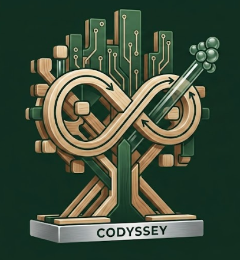
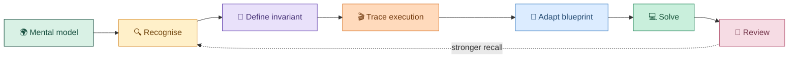

<div align="center">



# ✨ CODYSSEY

### Learn the pattern. Trace the state. Design the system.

**An interactive interview-preparation studio for DSA, HLD and LLD.**

<br />


</div>

---

## 🚀 Stop memorising. Start understanding.

Codyssey turns passive interview notes into an experience you can **see, control and explore**.

Instead of memorising isolated solutions, you learn:

- 🔍 **How to recognise a pattern**
- 🧠 **Which invariant makes the solution work**
- 🎮 **How state changes one step at a time**
- 🧩 **How to adapt a blueprint to unfamiliar problems**
- ⚖️ **How to explain design trade-offs like an engineer**

> [!IMPORTANT]
> Codyssey begins with the bird's-eye view, builds the mental model, traces the implementation, and only then asks you to solve problems.

---

## 🌈 What makes Codyssey different?

<table>
  <tr>
    <td width="50%">
      <h3>🎬 Interactive DSA traces</h3>
      Control execution with play, pause, restart, speed and step navigation. Follow highlighted Python, narration and live variables.
    </td>
    <td width="50%">
      <h3>🧠 Pattern playbooks</h3>
      Learn recognition signals, invariants, reusable implementation templates, complexity and common traps.
    </td>
  </tr>
  <tr>
    <td>
      <h3>🎨 Visual Problem Workspace</h3>
      Build and manipulate data structures while writing your invariant, pseudocode and edge-case tests beside them.
    </td>
    <td>
      <h3>🏗️ HLD + LLD from zero</h3>
      Move from web fundamentals and SOLID principles to distributed systems and complete interview designs.
    </td>
  </tr>
  <tr>
    <td>
      <h3>🎯 455 structured questions</h3>
      Practice by pattern and difficulty. Open the original problem while tracking completion separately.
    </td>
    <td>
      <h3>💾 Private, local progress</h3>
      No account or backend. Export and import progress whenever you move browsers or devices.
    </td>
  </tr>
</table>

---

## 🧭 The Codyssey learning loop



---

## 🧪 Visual Problem Workspace

> Draw the state **before** writing the code.

The freeform workspace supports:

| Structure | Visual model |
|---|---|
| 🧱 Arrays | Indexed, editable cells |
| 🟦 Matrices | Row and column coordinates |
| 🔗 Singly linked lists | `VALUE │ NEXT` pointer compartments |
| ↔️ Doubly linked lists | `PREV │ VALUE │ NEXT` reciprocal pointers |
| 📚 Stacks | LIFO cells with a visible `TOP` |
| 🚶 Queues | FIFO cells with `FRONT` and `REAR` |
| 🌳 Binary trees | `LEFT │ VALUE │ RIGHT` child pointers |
| 🔺 Heaps | Array-indexed parent and child relationships |
| 🔤 Tries | Character nodes with multi-child links |
| 🕸️ Graphs | Freeform nodes, edges and degree indicators |

### Workspace superpowers

- Add, edit, move, highlight and delete nodes
- Select pointer compartments and connect them visually
- Model linked-list intersections and shared tails
- Undo changes or clear the canvas
- Write the invariant, pseudocode and edge cases
- Automatically preserve every workspace in the browser

---

## 🗺️ One course. Three engineering lenses.

| 💻 DSA | 🌐 High-Level Design | 🧱 Low-Level Design |
|---|---|---|
| Patterns and invariants | Scale and distributed systems | Objects and responsibilities |
| Animated execution | Reliability and trade-offs | SOLID and design patterns |
| 455 practice questions | Production mental models | Extensible interview designs |
| Complexity analysis | Complete design interviews | Python implementation guidance |

The curriculum is divided into **12 recommended weeks**, but nothing is calendar-locked. Finish a week in two days or two months—Codyssey advances when you do.

---

## 🛠️ Built with

```text
⚛️  React 19                  🟦 TypeScript
⚡ Vite 6                     🎨 CSS animations
🔀 SVG visualisations         💾 Browser localStorage
🚀 GitHub Actions             🌍 GitHub Pages
```

Codyssey's learning experience is fully static. Optional, consented visitor tracking uses a Supabase table; all study progress remains local to the learner's browser.

---

## 📦 Production build

```powershell
npm run build
npm run preview
```

The deployable output is generated in `dist`.

---

## 🌍 Deploy with GitHub Pages

1. Push the project to a repository whose default branch is `main`.
2. Open **Settings → Pages**.
3. Set **Source** to **GitHub Actions**.
4. Push to `main`.
5. The included workflow builds and publishes `dist`.

> [!TIP]
> Vite uses relative asset paths, so repository-level GitHub Pages URLs are supported.

---

## 🔐 Progress and privacy

Your learning progress remains in your browser:

- Selected week and active section
- Completed modules
- Solved questions
- Visual workspaces and reasoning notes

When visitor tracking is configured, Codyssey records one anonymous visit per browser session. Saving a display name also sends that chosen name to the private analytics table after showing an in-app disclosure. No study progress is uploaded.

Use **Profile → Export progress** to create a JSON backup and **Import progress** to restore it elsewhere.

> [!WARNING]
> Clearing browser site data removes local progress unless you export a backup first.

---

## 🗂️ Project map

```text
src/
├── assets/                 Codyssey artwork
├── components/dsa/         Interactive traces and visual workspace
├── data/                   DSA catalog, theory, curricula and resources
├── App.tsx                 Navigation, lessons and progress
└── styles.css              Responsive UI and animations

scripts/                    DSA sheet processing tools
.github/workflows/          GitHub Pages deployment
```

---

## 📚 Content transparency

The lesson text is synthesised specifically for Codyssey rather than copied from external resources. The in-app Appendix links to the original DSA sheets, system-design guides, SRE books, design-pattern references, engineering blogs and visual-learning products that informed the curriculum.

---

<div align="center">

## Ready to begin your Codyssey? 🚀

**Understand deeply. Practise deliberately. Explain confidently.**

<sub>Because interview preparation is a journey—not a checklist.</sub>

</div>
